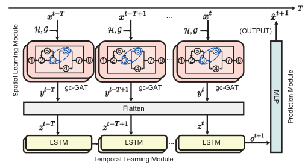

### 1. Introduction

This project is based on our accepted paper "Graph Attention LSTM for Load Prediction of
Fine-grained VNFs in SFC"

### 2. Prerequisites

torch==1.11.0+cu115

torch-geometric==2.0.4

scipy==1.9.3

pandas==1.2.4

### 3. Dataset

- The Public Dataset:
  
  I. B. Yahia, “Vnfdataset: virtual ip multimedia ip system,” 2019. [Online]. Available: https://www.kaggle.com/datasets/imenbenyahia/cle arwatervnf-virtual-ip-multimedia-ip-system

- The Synthetic Dataset:
  
  TimeGAN is a framework for generating realistic time series data. 
  
  J. Yoon, D. Jarrett, and M. Van der Schaar, “Time-series generative adversarial networks,”  Advances in neural information processing systems, vol. 32, 2019.

- 

### 4. GGAL model

- Spatial Learning Module (granularity captured graph attentional layers) + Temporal Learning Module (LSTM) + Prediction Module (MLP)

- 
